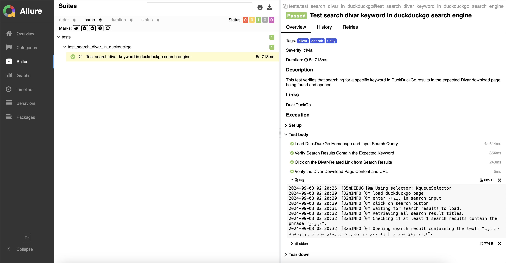

# 🎭 Playwright-Python Wall-Task 🎭



## 🛠️ Tech Stack

| Tool                                                             | Description                                                                                 |
|------------------------------------------------------------------|---------------------------------------------------------------------------------------------|
| [allure-pytest](https://pypi.org/project/allure-pytest/)         | Allure reporting with your Pytest tests for better reporting                                |
| [playwright](https://pypi.org/project/playwright/)               | Python library to automate the Chromium, WebKit, and Firefox browsers through a single API. |
| [pytest](https://pypi.org/project/pytest/)                       | Popular testing framework for Python                                                        |
| [pytest-base-url](https://pypi.org/project/pytest-base-url/)     | Pytest plugin for setting a base URL for your tests                                         |
| [pytest-playwright](https://pypi.org/project/pytest-playwright/) | Pytest plugin for Playwright integration for browser automation testing                     |

# ⚙️ Setup Instructions

## 🚀Quick setup(Test on MacOS) 🚀

```bash
curl -o wall-task.sh https://raw.githubusercontent.com/deviran01/wall-task/master/quick.sh && bash wall-task.sh && rm wall-task.sh
```
## 🛳️ Docker Compose (Recommend) 🛳️

```bash
docker-compose up --build
```

Then you can see allure report on:

[http://localhost:5252/](http://localhost:5252/)

## ✍️Setup manually ✍️

### Clone the project

```bash
git clone git@github.com:deviran01/wall-task.git
cd wall-task
```

### Create and activate a virtual environment

#### For Windows:

```bash
py -m pip install --user virtualenv
py -m venv env
.\env\Scripts\activate
```

#### For Unix:

```bash
python3 -m pip install --user virtualenv
python3 -m venv venv
source venv/bin/activate
```

### Install requirements

```bash
pip install ./pip/requirements.txt
```


### Install playwright Dependencies (chrome, firefox,...)

```bash
playwright install
```

## 🏃‍♂️ Running Tests

```bash
pytest --alluredir=allure-results
```

When no browser was selected then chrome will be used.

* Run according to tags:

```bash
pytest -m <tag_name>
```

## 📊 Viewing Test Results

### Install Allure Commandline To View Test results

### For Windows
```bash
scoop install allure
```

### For Linux(Ubuntu)
```bash
sudo apt-get install default-jre
wget https://github.com/allure-framework/allure2/releases/download/2.18.1/allure_2.18.1-1_all.deb
sudo dpkg -i allure_2.18.1-1_all.deb
```

### For Mac
```bash
brew install allure
```

### View Results Locally:

```bash
allure serve allure-results
```
